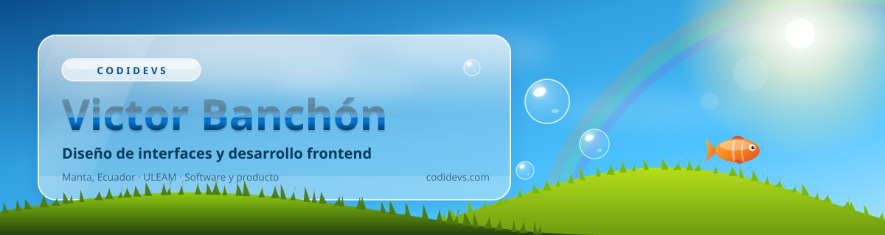
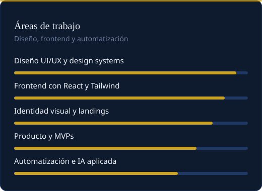
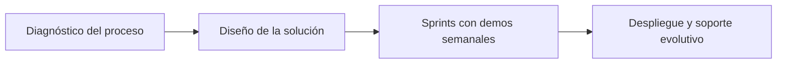

  

  
  
  
  
  

<!-- TODO: reemplaza TU-USUARIO en el link de LinkedIn por tu URL real antes de publicar -->

  

<table>
  <tr>
    <td width="58%">
      <h2>Diseño la interfaz, construyo el frontend y dejo el sistema funcionando</h2>
      

        Soy <strong>Victor Banchón</strong>, Ingeniero en Tecnologías de la Información por la ULEAM, en Manta, Ecuador.
        Fundé <strong>CodiDevs</strong>, donde diseñamos y desarrollamos software a medida para empresas:
        sistemas internos, CRMs, portales de operaciones y automatizaciones que conectan las herramientas que ya usan.
      

      

        Mi trabajo arranca en la experiencia. Entiendo el proceso real del cliente, lo ordeno en pantallas claras
        y recién ahí escribo el código. Diseño en Figma, construyo en React y Tailwind, y conecto los datos con APIs,
        Supabase y automatizaciones.
      

      

        Fuera del estudio compito en hackatones, que es donde más rápido aprendo a decidir qué no construir.
      

    </td>
    <td width="42%">
      
    </td>
  </tr>
</table>

## CodiDevs

Estudio de software y producto en Manta, trabajando de forma remota con empresas de Quito, Guayaquil, Cuenca y del resto del país. El foco no es vender herramientas nuevas, es quitar el trabajo manual: datos que viven en Excel, leads que se enfrían sin respuesta y procesos que nadie puede ver.

<table>
  <tr>
    <td width="50%">
      <h3>Sistemas internos y CRM</h3>
      
Centralización de leads, seguimiento comercial y recordatorios automáticos para que ningún prospecto quede sin atender.

    </td>
    <td width="50%">
      <h3>Portales de operaciones</h3>
      
Digitalización de solicitudes y flujos de aprobación con roles, trazabilidad y firmas.

    </td>
  </tr>
  <tr>
    <td width="50%">
      <h3>Automatización de procesos</h3>
      
Integraciones con n8n y APIs para mover datos entre las herramientas que la empresa ya tiene.

    </td>
    <td width="50%">
      <h3>Landings e identidad visual</h3>
      
Sitios de captación y sistemas visuales consistentes con la marca del cliente.

    </td>
  </tr>
</table>

## Productos y landings

Trabajo real que vive en la organización [CodiDevs](https://github.com/CodiDevs).

| Proyecto | Qué es | Tecnologías |
|---|---|---|
| [AllergenSmartV2](https://github.com/CodiDevs/AllergenSmartV2) | Producto para lectura y gestión de alérgenos | TypeScript |
| [nutriapp-android](https://github.com/CodiDevs/nutriapp-android) + [nutriapp-mockup](https://github.com/CodiDevs/nutriapp-mockup) | App de nutrición: cliente Android y mockup web | Kotlin, HTML |
| [Destello-catalogo](https://github.com/CodiDevs/Destello-catalogo) | Catálogo digital para ventas | TypeScript |
| [DemoLegalTech](https://github.com/CodiDevs/DemoLegalTech) | Producto demostrativo para el sector legal | TypeScript |
| [landingMoonDevs](https://github.com/CodiDevs/landingMoonDevs) · [LandingGonzalez](https://github.com/CodiDevs/LandingGonzalez) · [Landing_Calvache](https://github.com/CodiDevs/Landing_Calvache) | Landings de clientes con foco en conversión | TypeScript, Tailwind CSS |

## Stack

  

<table>
  <tr>
    <td><strong>Diseño</strong></td>
    <td>Figma, design systems, wireframes, prototipos, UI kits</td>
  </tr>
  <tr>
    <td><strong>Frontend</strong></td>
    <td>React, Next.js, TypeScript, Tailwind CSS, HTML y CSS, animación de interfaz</td>
  </tr>
  <tr>
    <td><strong>Datos</strong></td>
    <td>Supabase, PostgreSQL, REST APIs, Auth0</td>
  </tr>
  <tr>
    <td><strong>Automatización</strong></td>
    <td>n8n, Make, Zapier, OpenAI y Anthropic, WhatsApp con Twilio</td>
  </tr>
</table>

## Actividad

  
  

  
  

  <picture>
    <source media="(prefers-color-scheme: dark)" srcset="https://raw.githubusercontent.com/VxGM/VxGM/output/github-contribution-grid-snake-dark.svg">
    <source media="(prefers-color-scheme: light)" srcset="https://raw.githubusercontent.com/VxGM/VxGM/output/github-contribution-grid-snake.svg">
    
  </picture>

## Contacto

  

  <strong>Si tu equipo sigue copiando datos entre Excel y WhatsApp, eso tiene solución.</strong>

