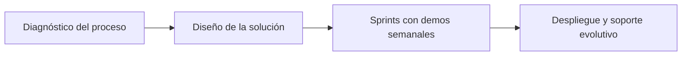

```text
╔═ VxGM ════════════════════════════════════════════════════════╗
║        ██╗   ██╗██╗ ██████╗████████╗ ██████╗ ██████╗          ║
║        ██║   ██║██║██╔════╝╚══██╔══╝██╔═══██╗██╔══██╗         ║
║        ██║   ██║██║██║        ██║   ██║   ██║██████╔╝         ║
║        ╚██╗ ██╔╝██║██║        ██║   ██║   ██║██╔══██╗         ║
║         ╚████╔╝ ██║╚██████╗   ██║   ╚██████╔╝██║  ██║         ║
║          ╚═══╝  ╚═╝ ╚═════╝   ╚═╝    ╚═════╝ ╚═╝  ╚═╝         ║
║                                                               ║
║                                            ▄▄▄▄▄▄▄            ║
║ ██████╗  █████╗ ███╗   ██╗ ██████╗██╗  ██╗ ██████╗ ███╗   ██╗ ║
║ ██╔══██╗██╔══██╗████╗  ██║██╔════╝██║  ██║██╔═══██╗████╗  ██║ ║
║ ██████╔╝███████║██╔██╗ ██║██║     ███████║██║   ██║██╔██╗ ██║ ║
║ ██╔══██╗██╔══██║██║╚██╗██║██║     ██╔══██║██║   ██║██║╚██╗██║ ║
║ ██████╔╝██║  ██║██║ ╚████║╚██████╗██║  ██║╚██████╔╝██║ ╚████║ ║
║ ╚═════╝ ╚═╝  ╚═╝╚═╝  ╚═══╝ ╚═════╝╚═╝  ╚═╝ ╚═════╝ ╚═╝  ╚═══╝ ║
╚═══════════════════════════════════════════════════════════════╝
```

[ codidevs.com ](https://codidevs.com/) · [ LinkedIn ](https://www.linkedin.com/in/victor-banch%C3%B3n-6881b2356/) · [ Instagram ](https://www.instagram.com/vcrthor/)

```text
╔═ about ═══════════════════════════════════════════════════════╗
║  VICTOR BANCHÓN                                               ║
║  Ingeniero en Tecnologías de la Información · ULEAM           ║
║  Manta, Ecuador · github.com/VxGM                             ║
║                                                               ║
╠═══════════════════════════════════════════════════════════════╣
║  » Diseño la interfaz, construyo el frontend y dejo el        ║
║    sistema funcionando.                                       ║
║                                                               ║
║  » Fundé CodiDevs: sistemas internos, CRMs, portales de       ║
║    operaciones y automatizaciones para empresas.              ║
║                                                               ║
║  » Entiendo el proceso real del cliente, lo ordeno en         ║
║    pantallas claras y recién ahí escribo el código:           ║
║    Figma → React → Tailwind → Supabase → APIs.                ║
║                                                               ║
║  » Fuera del estudio: hackatones, donde más rápido            ║
║    aprendo qué NO construir.                                  ║
║                                                               ║
║  » ¿Tienes datos copiando entre Excel y WhatsApp?             ║
║    Eso tiene solución. → codidevs.com                         ║
╚═══════════════════════════════════════════════════════════════╝
```

```text
════════════════════════════════╦════════════════════════════════
```

## CodiDevs

Estudio de software y producto en Manta, trabajando de forma remota con empresas de Quito, Guayaquil, Cuenca y del resto del país. El foco no es vender herramientas nuevas, es quitar el trabajo manual: datos que viven en Excel, leads que se enfrían sin respuesta y procesos que nadie puede ver.


```mermaid
flowchart LR
  A["Diagnóstico del proceso"] --> B["Diseño de la solución"]
  B --> C["Sprints con demos semanales"]
  C --> D["Despliegue y soporte evolutivo"]
```

<table>
  <tr>
    <td width="50%">
      <h3>Sistemas internos y CRM</h3>
      <p>Centralización de leads, seguimiento comercial y recordatorios automáticos para que ningún prospecto quede sin atender.</p>
    </td>
    <td width="50%">
      <h3>Portales de operaciones</h3>
      <p>Digitalización de solicitudes y flujos de aprobación con roles, trazabilidad y firmas.</p>
    </td>
  </tr>
  <tr>
    <td width="50%">
      <h3>Automatización de procesos</h3>
      <p>Integraciones con n8n y APIs para mover datos entre las herramientas que la empresa ya tiene.</p>
    </td>
    <td width="50%">
      <h3>Landings e identidad visual</h3>
      <p>Sitios de captación y sistemas visuales consistentes con la marca del cliente.</p>
    </td>
  </tr>
</table>

```text
════════════════════════════════╦════════════════════════════════
```

## Productos y landings

Trabajo real que vive en la organización [CodiDevs](https://github.com/CodiDevs).

| Proyecto | Qué es | Tecnologías |
|---|---|---|
| [AllergenSmartV2](https://github.com/CodiDevs/AllergenSmartV2) | Producto para lectura y gestión de alérgenos | TypeScript |
| [nutriapp-android](https://github.com/CodiDevs/nutriapp-android) + [nutriapp-mockup](https://github.com/CodiDevs/nutriapp-mockup) | App de nutrición: cliente Android y mockup web | Kotlin, HTML |
| [Destello-catalogo](https://github.com/CodiDevs/Destello-catalogo) | Catálogo digital para ventas | TypeScript |
| [DemoLegalTech](https://github.com/CodiDevs/DemoLegalTech) | Producto demostrativo para el sector legal | TypeScript |
| [landingMoonDevs](https://github.com/CodiDevs/landingMoonDevs) · [LandingGonzalez](https://github.com/CodiDevs/LandingGonzalez) · [Landing_Calvache](https://github.com/CodiDevs/Landing_Calvache) | Landings de clientes con foco en conversión | TypeScript, Tailwind CSS |

```text
════════════════════════════════╦════════════════════════════════
```

## Stack

<p align="center">
  
</p>

<table>
  <tr>
    <td><strong>Diseño</strong></td>
    <td>Figma, design systems, wireframes, prototipos, UI kits</td>
  </tr>
  <tr>
    <td><strong>Frontend</strong></td>
    <td>React, Next.js, TypeScript, Tailwind CSS, HTML y CSS, animación de interfaz</td>
  </tr>
  <tr>
    <td><strong>Datos</strong></td>
    <td>Supabase, PostgreSQL, REST APIs, Auth0</td>
  </tr>
  <tr>
    <td><strong>Automatización</strong></td>
    <td>n8n, Make, Zapier, OpenAI y Anthropic, WhatsApp con Twilio</td>
  </tr>
</table>

```text
════════════════════════════════╦════════════════════════════════
```

## Actividad

<p align="center">
  <a href="https://github.com/VxGM/VxGM/stargazers"></a>
  <a href="https://github.com/VxGM/VxGM/commits/main"></a>
</p>

<p align="center">
  
</p>

<p align="center">
  <picture>
    <source media="(prefers-color-scheme: dark)" srcset="https://cdn.jsdelivr.net/gh/VxGM/VxGM@output/github-contribution-grid-snake-dark.svg">
    <source media="(prefers-color-scheme: light)" srcset="https://cdn.jsdelivr.net/gh/VxGM/VxGM@output/github-contribution-grid-snake.svg">
    
  </picture>
</p>

```text
════════════════════════════════╦════════════════════════════════
```

## Contacto

<p align="center">
  <a href="https://codidevs.com/"></a>
</p>

<p align="center">
  <strong>Si tu equipo sigue copiando datos entre Excel y WhatsApp, eso tiene solución.</strong>
</p>
